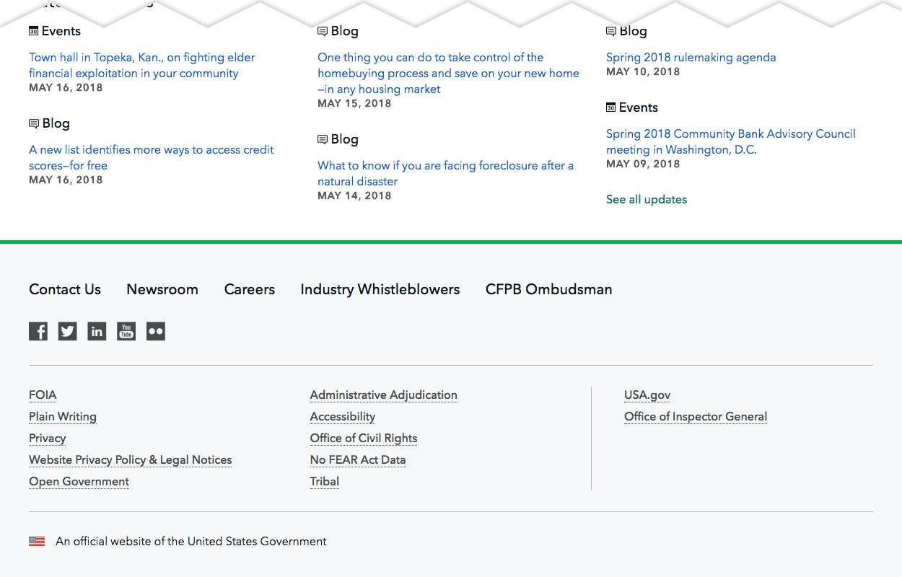

# Tear Shot

Tear Shot is a dinky little Photoshop template that makes it easy to cut out extraneous parts of long images to help focus attention on the pieces that matter. I need to do this all the time when I'm sharing screenshots of long web pages I'm designing and don't care about the top, bottom, or middle parts of a page. Just cropping the screenshots made them look a little janky, so I made the Tear Shot template to make things look a little classier. Like so:

Bottom torn off | Top torn off | Top and bottom torn off | Middle torn out
--------------- | ------------ | ----------------------- | ---------------
 |  |  | 

If you want to make swanky torn looking images like that, just download `tear-shot.psd`, plop the image you want to tear in the right layer, adjust the position and layer mask to only show what you want, and toggle the background off if you don't want it.